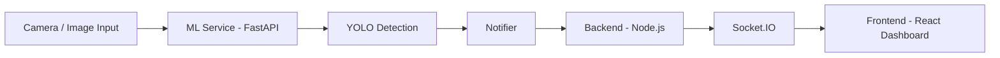
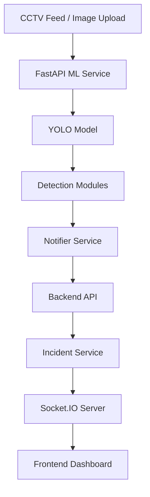
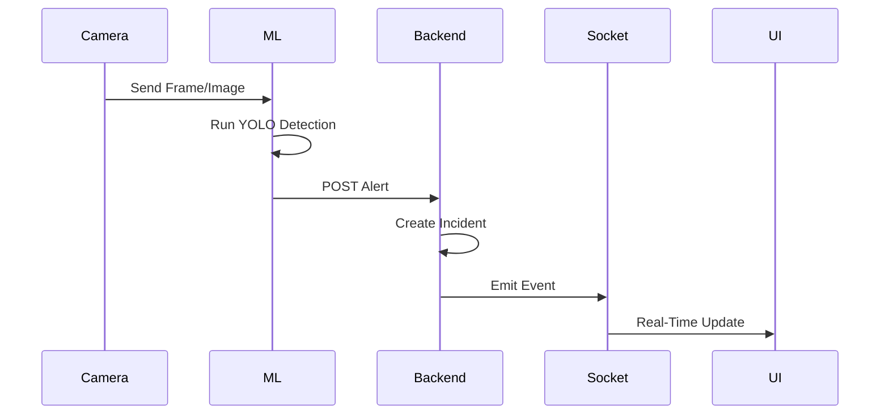
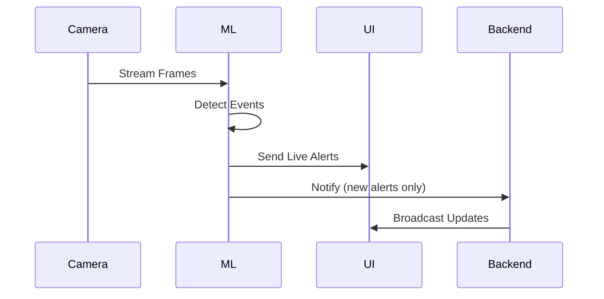

# 🚨 SurviLens  
### AI-Powered Real-Time Surveillance & Incident Detection System  

SurviLens is an intelligent AI system that detects incidents from CCTV feeds in real-time and delivers instant alerts through a live dashboard.

It integrates computer vision (YOLO), FastAPI (ML services), Node.js backend, and Socket.IO to create a seamless event-driven pipeline from detection to user interface.

---

## 🧠 Key Features

- Real-time CCTV frame processing  
- AI-based incident detection (violence, crowding, fall)  
- Live alerts using WebSockets  
- Real-time dashboard updates  
- Event-driven architecture  
- Secure service-to-service communication  

---

## 🏗️ System Architecture

### High-Level Architecture



---

### Detailed Architecture



---

## 🔄 System Flow

### Detection Pipeline



---

### Real-Time Streaming Flow



---

## 🔐 Security

Internal communication between ML services and backend is secured using a service key.

- ML sends requests with a secure header  
- Backend validates incoming requests  
- Prevents unauthorized alert injection  

---

## 🚀 Getting Started

### Backend
```
cd backend  
npm install  
npm run dev
``` 
### ML Service
```
cd ml_services  
pip install -r requirements.txt  
uvicorn main:app --reload
``` 

### Frontend
```
cd frontend  
npm install  
npm run dev
```  

---

## 🧪 Testing

Trigger detection manually:

POST /detect/frame  

Expected result:
- Backend creates an incident  
- Frontend updates instantly  

---

## 🧠 Tech Stack

- Frontend: React, Tailwind CSS, Vite  
- Backend: Node.js, Express, Socket.IO  
- ML Services: FastAPI, OpenCV, YOLO  
- Communication: REST + WebSockets  
- Architecture: Event-driven  

---

## 🎯 Use Cases

- Smart surveillance systems  
- Public safety monitoring  
- Campus / office security  
- Real-time emergency detection  

---

## 🚀 Future Enhancements

- 📱 SMS/Call alert integration using Twilio  
- 🔔 Push notifications using Firebase  
- 👤 Role-based authentication and user management  
- 🗺️ Real-time incident mapping (Google Maps integration)  
- 🚓 Automated responder dispatch system  
- 🧠 Improved ML models for higher accuracy  
- 🗄️ Persistent database integration (MongoDB/PostgreSQL)  
- 📊 Advanced analytics dashboard (trends, heatmaps)  

---

## 📌 Conclusion

SurviLens connects:

Computer Vision → Backend Systems → Real-Time User Interface  

It is designed to be scalable, modular, and ready for real-world deployment.

---

## 👨‍💻 Author

Developed as a hackathon project focused on AI-driven real-time systems and full-stack integration.
