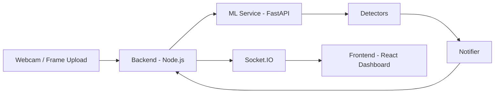

# SurviLens
### AI-Powered Real-Time Surveillance & Incident Detection System

SurviLens detects incidents from video frames and delivers live alerts to a dashboard.

**Current input:** browser webcam (demo). Real CCTV/RTSP is not wired yet.

Stack: computer vision (YOLO + detectors), FastAPI ML service, Node.js backend, Socket.IO, React dashboard.

---

## Key Features

- Webcam frame capture from the dashboard
- AI-based incident detection (violence, fall, chase, SOS gesture, audio keyword)
- Live alerts over WebSockets
- Service-to-service auth via shared `INTERNAL_SERVICE_KEY`
- Alert cooldown to reduce duplicate incidents

---

## System Architecture


```mermaid
flowchart LR
    A[Webcam / Frame Upload] --> B[Backend - Node.js]
    B --> C[ML Service - FastAPI]
    C --> D[Detectors]
    D --> E[Notifier]
    E --> B
    B --> F[Socket.IO]
    F --> G[Frontend - React Dashboard]
```

---

## Security

ML → backend alerts require header `x-service-key` matching `INTERNAL_SERVICE_KEY` on both services.

- If the key is missing on the backend, `/alerts` returns `503`
- If the key is wrong, `/alerts` returns `403`
- Empty keys are never treated as valid

---

## Getting Started

### 1. Environment files

Copy examples and use the **same** service key in backend and ML:

```bash
cp backend/.env.example backend/.env
cp ml_services/.env.example ml_services/.env
cp frontend/.env.example frontend/.env
```

Minimum required:

| Variable | Where | Example |
|----------|--------|---------|
| `INTERNAL_SERVICE_KEY` | backend + ML | long shared secret |
| `ML_URL` | backend | `http://localhost:8000` |
| `BACKEND_URL` | ML | `http://localhost:4000/alerts` |
| `VITE_API_BASE_URL` | frontend | `http://localhost:4000` |
| `VITE_SOCKET_URL` | frontend | `http://localhost:4000` |
| `VITE_GOOGLE_MAPS_API_KEY` | frontend | optional |

### 2. Backend

```bash
cd backend
npm install
npm run dev
```

Health: `GET http://localhost:4000/health`

### 3. ML Service

```bash
cd ml_services
pip install -r requirements.txt
uvicorn main:app --reload --port 8000
```

Health: `GET http://localhost:8000/health`

### 4. Frontend

```bash
cd frontend
npm install
npm run dev
```

Open the Vite URL (usually `http://localhost:5173`), click a camera card, allow webcam access.

---

## Testing

### Health checks

```bash
curl http://localhost:4000/health
curl http://localhost:8000/health
```

### Manual alert (Socket.IO / dashboard)

```bash
curl -X POST http://localhost:4000/alerts \
  -H "Content-Type: application/json" \
  -H "x-service-key: change-me-to-a-long-secret" \
  -d "{\"type\":\"fall\",\"cameraId\":\"CAM_01\",\"confidence\":0.95,\"location\":{\"zone\":\"Lobby\"}}"
```

Use the same key as in your `.env` files.

### Webcam path

1. Start ML, backend, and frontend
2. Open dashboard → select `CAM_01`
3. Allow camera permission
4. Frames post to backend `/detect` → ML `/detect/frame` every ~3s
5. New incidents appear live when detectors fire (and after cooldown)

---

## Tech Stack

- Frontend: React, Tailwind CSS, Vite, Socket.IO client
- Backend: Node.js, Express, Socket.IO
- ML: FastAPI, OpenCV, YOLO, MediaPipe
- Data: in-memory for now (no database yet)

---

## Use Cases

- Campus / office security demos
- Public safety prototypes
- Hackathon / PoC surveillance dashboards

---

## Roadmap (not done yet)

- Persistent database (MongoDB/PostgreSQL)
- Auth and role-based access
- SMS/Call (Twilio) and push (Firebase)
- RTSP / real CCTV ingestion
- Docker Compose deployment
- Analytics dashboard

---

## Author

Hackathon prototype focused on AI-driven real-time systems and full-stack integration. Moving toward production readiness step by step.
